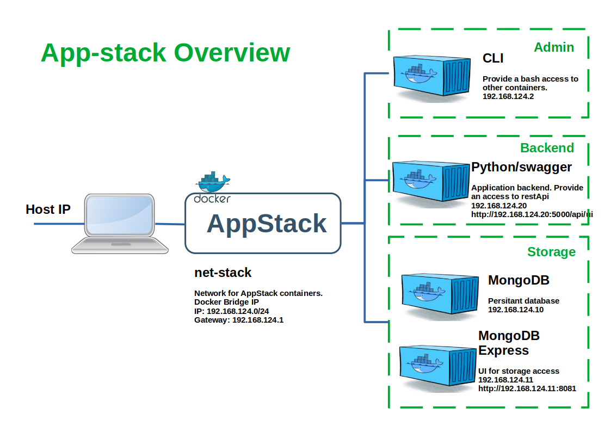

# App Stack

Stack to develop and run an application using Mongodb - Golang and VueJs



To run the environment:

```
docker-compose up
```

## Model - MongoDb

It is composed of 2 Docker images:
- MongoDb
- MongoDb-express

MongoDb contains the database used for the application.[(Official Documentation)](https://hub.docker.com/_/mongo)

MongoDb-express is used for dev and debug purposes to easily see the database.[(Official Documentation)](https://hub.docker.com/_/mongo-express)


## CLI - Bash

This image allow to debug and connect other images. This allow to perform actions on other container.

To launch it:
```
docker-compose run cli
```

for example, to get IP address of mongodb-express image:
```
bash-5.1# ping mongo-express
PING mongo-express (172.22.0.4): 56 data bytes
64 bytes from 172.22.0.4: seq=0 ttl=64 time=0.294 ms
64 bytes from 172.22.0.4: seq=1 ttl=64 time=0.173 ms
64 bytes from 172.22.0.4: seq=2 ttl=64 time=0.172 ms 
```
